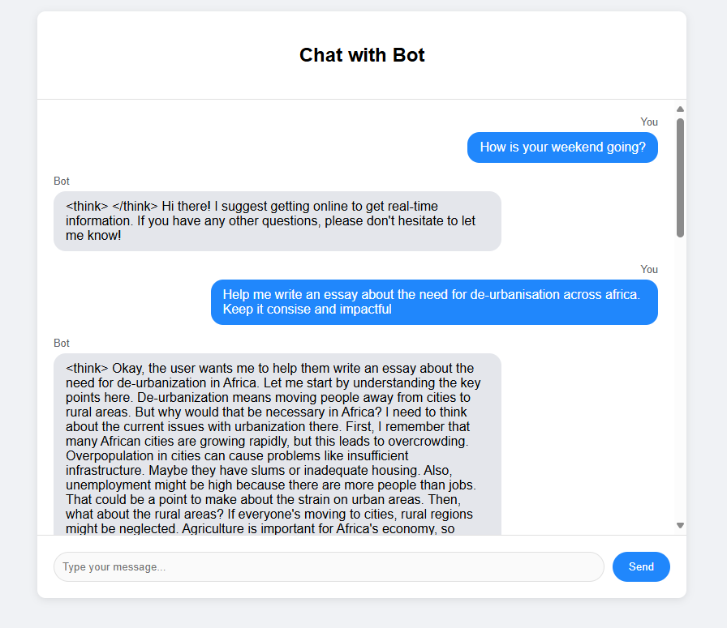

# Trae Chat

Trae Chat is a real-time chat application built with FastAPI and WebSocket, featuring a modern and responsive user interface. This project demonstrates how to create a simple chatbot interface with real-time communication capabilities.



## Features

- Real-time messaging using WebSocket
- Clean and modern user interface
- Responsive design that works on both desktop and mobile
- Simple bot responses to user messages
- Message history tracking

## Prerequisites

Before you begin, ensure you have Python 3.7+ installed on your system.

## Installation

1. Clone the repository:
   ```bash
   git clone https://github.com/rihoneailabs/trae-chat.git
   cd trae-chat
   ```

2. Install the required dependencies:
   ```bash
   pip install -r requirements.txt
   ```

## Running the Application

1. Start the FastAPI server:
   ```bash
   python main.py
   ```
   Or alternatively:
   ```bash
   uvicorn main:app --reload
   ```

2. Open your web browser and navigate to:
   ```
   http://localhost:8000
   ```

## Project Structure

```
.
├── main.py           # FastAPI application and WebSocket endpoints
├── requirements.txt  # Python dependencies
├── static/          # Static files directory
│   └── index.html   # Frontend chat interface
└── README.md        # Project documentation
```

## Development

The application consists of two main components:

1. Backend (main.py):
   - FastAPI server handling WebSocket connections
   - Chat history management
   - Bot response logic

2. Frontend (static/index.html):
   - Modern chat interface
   - Real-time message updates
   - WebSocket client implementation

## License

This project is open-source and available under the MIT License.

## Acknowledgments

Built with Trae IDE - A powerful AI-powered development environment.
